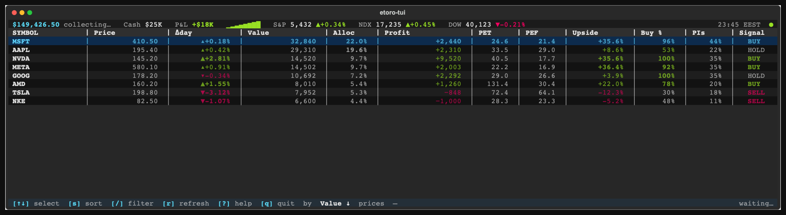

# etoro-tui

> Live eToro portfolio in your terminal — Bloomberg-style table with color-graded P&L, day-change, and inline indices.

[](https://github.com/weirdapps/etoro-tui/actions/workflows/ci.yml)
[](https://www.python.org/downloads/)
[](LICENSE)
[](https://pypi.org/project/etoro-tui/)



*Screenshot taken in `--demo` mode (synthetic 8-position portfolio, no credentials needed).*

> [!IMPORTANT]
> ## Generate a READ-ONLY API key
>
> When you create your eToro Public API key (Settings → Trading → API Key Management), **set the permission to `Read` only**. Do **not** grant `Write`.
>
> - etoro-tui only ever calls **read** endpoints (`GET /portfolio`, `GET /market-data/instruments/rates`). Write access is unnecessary for everything this tool does.
> - With a Read-only key, even if the credential leaks, an attacker cannot place trades, withdraw funds, or modify your positions on your behalf — they only see what you'd see.
> - The setup wizard reminds you of this when generating keys. There is no "default to least privilege" setting on eToro's side — it's on you to pick `Read` at key-creation time.

## What this tool does — and what it does **not** do

**Does:**
- Reads your live portfolio: positions, cash, equity, open P&L
- Pulls live market prices (5-second poll) — Price column shows the listing-currency quote (matches Yahoo / eToro web), Value / Profit roll up in USD
- Overlays analyst fundamentals (P/E, target upside, % buy) and BUY/HOLD/SELL signals from open-source data sources
- Displays the result in a Bloomberg-style terminal dashboard
- Stores 1-minute equity snapshots locally (`~/.etoro-tui/snapshots.db`) for the "today's Δ" baseline

**Does NOT:**
- Place trades (buy, sell, close positions) — read-only API endpoints, no exception
- Deposit or withdraw funds — eToro Public API doesn't even expose those endpoints
- Modify stop-loss, take-profit, or any other order parameters
- Send notifications, post to social, or share data with third parties
- Store or transmit your API keys anywhere except your local machine (env vars, `~/.etoro-tui/.env` mode 600, or your OS keyring)
- Phone home — no telemetry, no analytics, no error reporting service

## Features

- **Live prices** — eToro `/market-data/instruments/rates` polled every 5s. Price column shows the listing-currency quote (`LYXGRE.DE` 2.51 EUR, `PRU.L` 1,138.50 GBp, `0700.HK` 464.80 HKD); the `Curr` column tags each row's currency. Value / Profit / Allocation are FX-converted to USD (account currency) so totals roll up correctly.
- **Bloomberg-style colour grading** — 3-tier intensity (bold bright / normal / dim) on Δday and Profit so magnitude pops at a glance. Magnitude-coded triangles (▲▴▾▼) for direction-and-size in one glyph.
- **Honest day-change** — Δday computed from yesterday's close (census `priceData`) FX-adjusted to USD, not lifetime return relabeled
- **Parametric flex columns** — table fills any terminal width via per-column min + flex weights. Verified at 140 / 180 / 220 / 240 cols.
- **Inline header indices** — S&P 500, NASDAQ, Dow 30 in their native quote currency (USD); a configured Greek ETF / EuroStx50 line shows in EUR. Up to 3 fit in the bar.
- **Aggregated by ticker** — many lots per symbol collapsed into one row with weighted-avg open and total P&L
- **Fundamentals** — trailing/forward P/E, analyst target upside, % buy ratings, 3-month change in buy% (ΔBuy), popular-investor holding rate
- **Honest labels** — "Δday" not "Δ%"; "Profit" is lifetime, "Δday" is today; "—" when census coverage is missing rather than fake zeros
- **Local-first, GitHub-fallback** for the daily-refreshed data sources (no scraping, no API keys for census/signals)
- **Single-line footer** — key legend + sort + last-fetch + status. No detail panel; the table IS the dashboard.

## Install

From the [latest GitHub Release](https://github.com/weirdapps/etoro-tui/releases/latest) wheel:

```bash
pipx install https://github.com/weirdapps/etoro-tui/releases/download/v0.4.0/etoro_tui-0.4.0-py3-none-any.whl
```

From source:

```bash
git clone https://github.com/weirdapps/etoro-tui.git
cd etoro-tui
uv venv --python 3.13
source .venv/bin/activate
uv pip install -e ".[dev,keyring]"
```

Once published to PyPI:

```bash
pipx install etoro-tui                       # env vars or .env file only
pipx install "etoro-tui[keyring]"            # adds OS keyring support
```

Requires Python 3.13+.

## Credentials

Keys are read in priority order: **environment variables → `~/.etoro-tui/.env` file → system keyring**. The setup wizard picks the best storage option for your platform.

### Per-platform credential storage

| Platform | Backend (with `[keyring]` extra) | Just works? | Notes |
|---|---|---|---|
| **macOS** | Keychain | ✅ | Keys appear in Keychain Access under service `etoro-public-key` / `etoro-user-key`. |
| **Windows** | Credential Manager | ✅ | Keys appear in Control Panel → Credential Manager → Generic Credentials. Persists across logins. |
| **Linux desktop** (GNOME/KDE) | Secret Service / GNOME Keyring / KWallet | ⚠️ | Needs an unlocked keyring. First call may prompt for the keyring password. |
| **Linux headless / SSH / Docker** | n/a | ❌ | No D-Bus → keyring fails. Wizard automatically falls back to `~/.etoro-tui/.env` (chmod 600). |
| **CI / GitHub Actions** | n/a | n/a | Inject `ETORO_PUBLIC_KEY` / `ETORO_USER_KEY` as repository secrets — env vars take priority. |

If `keyring` isn't installed (or fails on Linux without D-Bus), the app still works — just use env vars or the `.env` file. The wizard detects what's available and offers the right options.

### Setup wizard

```bash
etoro-tui setup
```

It walks you through:

1. **Generating an eToro API key** — Settings → Trading → API Key Management. **Set the permission to `Read` only** — etoro-tui never needs Write. Copy both keys *immediately*; eToro shows the user-key only once.
2. **Pasting both keys** — Public Key and User Key.
3. **Choosing where to store them** — `~/.etoro-tui/.env` file (chmod 600), system keyring (if `[keyring]` extra installed and available), or just print `export` commands for your shell profile.
4. **(Optional) seeding `~/.etoro-tui/config.toml`** from the documented template at [`docs/config.example.toml`](docs/config.example.toml).

If you already have credentials configured, the wizard offers to either keep them (and just change where they're stored) or rotate them.

### Without the wizard

```bash
export ETORO_PUBLIC_KEY="..."
export ETORO_USER_KEY="..."
```

…or write the same lines to `~/.etoro-tui/.env`:

```bash
mkdir -p ~/.etoro-tui
chmod 700 ~/.etoro-tui
cat > ~/.etoro-tui/.env <<EOF
ETORO_PUBLIC_KEY=...
ETORO_USER_KEY=...
EOF
chmod 600 ~/.etoro-tui/.env
```

## Usage

```bash
etoro-tui            # launch the dashboard
etoro-tui --demo     # preview the UI with synthetic data — no credentials needed
etoro-tui --version
```

Logs go to `~/.etoro-tui/etoro-tui.log` (httpx requests pinned to WARNING). Tail it if you need to debug an auth or rate-limit issue.

### Key bindings

| Key | Action |
|---|---|
| `↑` `↓` | Move row selection |
| `s` | Cycle sort: Value → Profit → Δday → Upside → Buy % → PEF → Signal → Symbol |
| `/` | Filter rows by symbol substring; `Esc` clears |
| `r` | Refresh now (bypass the 5s timer) |
| `?` | Help modal (column docs + data freshness) |
| `q` / `Ctrl-C` | Quit |

## Configuration

Optional file at `~/.etoro-tui/config.toml`. Every section is optional; missing keys fall back to baked-in defaults. See [`docs/config.example.toml`](docs/config.example.toml) for the full template.

```toml
[indices]
# Up to 3 indices fit in the header. Set order = priority.
list = [
  ["S&P 500",   "SPX500"],
  ["NASDAQ",    "NSDQ100"],
  ["Dow 30",    "DJ30"],
  ["DAX",       "GER40"],
  ["FTSE",      "UK100"],
]

[paths]
# Override only if you have local copies of the public datasets:
# signals_csv = "~/SourceCode/etorotrade/yahoofinance/output/etoro.csv"
# census_dir  = "~/SourceCode/etoro_census/archive/data"
```

## How it works

| Source | What it provides | Refresh |
|---|---|---|
| `www.etoro.com/api/public /api/v1/trading/info/portfolio` | open positions + cash | live (5s poll) |
| `www.etoro.com/api/public /api/v1/market-data/instruments/rates` | last/bid/ask + FX rates | live (5s poll) |
| [`weirdapps/etorotrade`](https://github.com/weirdapps/etorotrade) `etoro.csv` | analyst signals + P/E + upside + buy% + 3-month buy% change | daily (~22:00 UTC) |
| [`weirdapps/etoro_census`](https://github.com/weirdapps/etoro_census) `etoro-data-*.json` | popular-investor holdings + close prices | daily (~03:00 UTC) |

Local files (if you have the source repos cloned) take priority; otherwise the daily-refreshed sources are pulled from GitHub raw / Contents API and cached in `~/.etoro-tui/cache/` for 6 hours.

A 1-minute equity snapshot is written to `~/.etoro-tui/snapshots.db` for the header sparkline and "today's Δ" baseline.

### Architecture

```
src/etoro_tui/
├── app.py              ← Textual App: timers, AppState, key bindings
├── models.py           ← Frozen dataclasses
├── config.py           ← TOML + env + keyring credential resolution
├── storage.py          ← SQLite snapshots
├── demo.py             ← --demo synthetic data
├── setup_wizard.py     ← `etoro-tui setup`
├── clients/
│   ├── etoro.py        ← async REST with retry + backoff
│   ├── signals.py      ← etorotrade CSV (local → GitHub fallback)
│   ├── census.py       ← etoro_census JSON (local → GitHub Contents API)
│   └── remote_fetch.py ← stdlib urllib + ~/.etoro-tui/cache/
└── widgets/
    ├── header.py       ← single-row equity + indices + clock + status
    ├── positions_table.py  ← parametric flex-column DataTable
    ├── footer.py       ← key legend + sort + status
    └── help_modal.py
```

Strict layering: `clients/` does I/O only, `widgets/` does rendering only, `app.py` is the only place that imports both.

### Column widths are parametric

Each column has a **minimum inner width** (hard floor) and a **flex weight** (proportion of leftover terminal width). On mount and on terminal resize, `compute_widths(available)` distributes the spare space proportionally so the table fills your screen — verified working at 140, 180, 220, and 240 cols. Profit / Value / Price get higher weights because their numbers benefit from breathing room; PET / PIs / Buy % / ΔBuy get lower weights because their values are 4–5 chars and look weird with lots of trailing space.

## Security hardening

The "what it does / doesn't do" and "use a Read-only key" guidance lives at the top of this README — read those first if you skipped them. This section documents the implementation hardening on top of that scope contract.

**Personal portfolio dashboard. Single-user, runs locally on your machine.**

What's hardened:

- Sensitive files in `~/.etoro-tui/` (`snapshots.db`, `.env`, `etoro-tui.log`) are written with mode `0o600`; the directory is `0o700`. POSIX-only — Windows users should rely on user-account isolation or the system keyring instead of the `.env` file
- `.env` writes use `os.open(O_CREAT|O_EXCL, mode=0o600)` to avoid TOCTOU
- HTTPS hardcoded; no plaintext fallback
- All SQL queries parameterized
- httpx logs pinned to WARNING (no request URLs / no headers in the log file)
- File logging only — never to terminal — with rotation (4 MB cap)
- CI runs `ruff` + `pip-audit` + `gitleaks` on every push and PR
- Pre-commit `gitleaks` hook (custom rules in [`.gitleaks.toml`](.gitleaks.toml)) blocks committing secrets locally; same scan runs in CI as a backstop
- GitHub native secret scanning + push protection enabled on this repo
- Dependabot enabled for `pip` + GitHub Actions

What's **not** done:

- No third-party security audit
- No penetration testing
- No certificate pinning
- Single maintainer (bus factor 1)
- No SLSA provenance or signed releases on PyPI

If your threat model requires any of these, **do not run etoro-tui in that environment.** Vulnerability reports: see [`SECURITY.md`](SECURITY.md).

## Disclaimer

**Unofficial open-source tool. Not affiliated with eToro.**
**Not financial advice. Use at your own risk.**

Numbers shown may differ from your eToro app — verify in the official platform before any trading decision. Common reasons for small discrepancies:

- FX conversion uses the rate at position-open time for the cost basis (a few percent drift over months); current value uses live FX
- Census prices update once daily (used as fallback when live rates fail)
- Open P&L excludes realized profit (eToro's "Total P&L" includes both)

## Contributing

Issues and PRs welcome. Before opening a PR:

```bash
uv pip install -e ".[dev]"
pytest                           # 54 tests, ~1s
python -m etoro_tui --demo       # smoke-test the UI
```

CI runs on Python 3.13 against Ubuntu + macOS for every push and PR.

### Pre-commit secret scanning

The repo ships a `gitleaks` pre-commit hook (custom rules in
[`.gitleaks.toml`](.gitleaks.toml)) that blocks any commit containing API
keys or account-fingerprint dollar amounts. Install once after cloning:

```bash
pip install pre-commit
pre-commit install
```

The same scan also runs in CI as a backstop on every push and PR.

Areas where contributions would land cleanly:

- More built-in indices (FTSE 250, ASX 200, KOSPI…)
- Localized number formatting (EUR-style 1.234,56)
- Additional fundamentals columns (dividend yield, ROE, debt/equity — already in the source CSV)
- Per-row hover/popup with full position dossier (the old DetailPanel was removed because it relied on local-only data; a hover-only variant could work for everyone)

## License

MIT — see [LICENSE](LICENSE).
